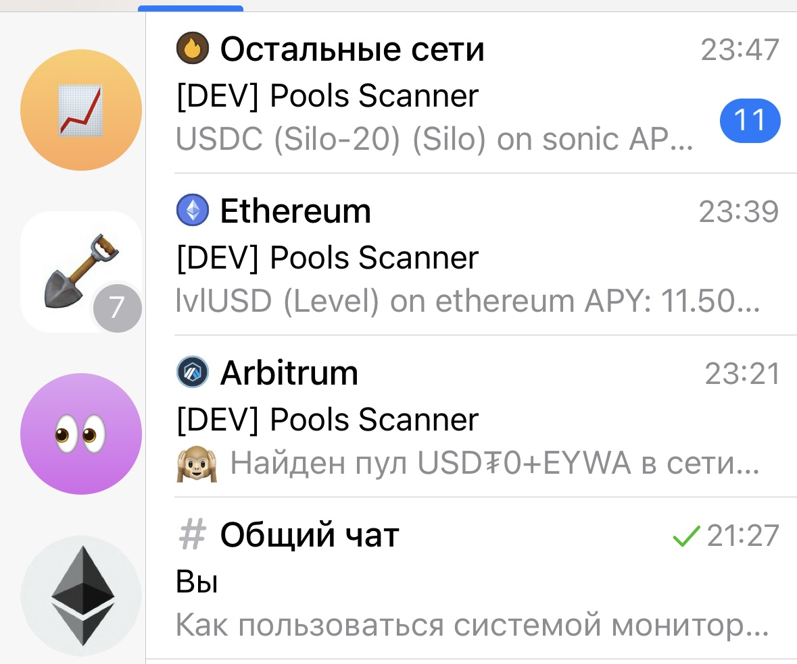

**🚀 DeFi Pulse: Пассивный доход на стейблкоинах без рутины**  

Автоматический поиск высокодоходных пулов в топовых DeFi-протоколах. Получайте уведомления в Telegram — вы инвестируете, мы анализируем.  

---

### **✨ Преимущества**  

- **Только стейблкоины** (USDT, USDC, DAI) — защита от волатильности.  
- **Экономия 15+ часов в неделю**: Мониторим Balancer, AAVE, Uniswap и другие аудированные протоколы за вас.  
- **Безопасность**: Никакого доступа к вашим кошелькам. Только аналитика — финальное решения за вами.  
- **Фильтрация рисков**: Пулы с низкой ликвидностью или сомнительной историей отсеиваются.  

---

### **🔍 Как это работает?**  

1. Сканируем 10+ протоколов в реальном времени (Curve, Compound, Morpho и др.).  
2. Находим пулы с высоким APR и стабильной ликвидностью.  
3. Отправляем уведомление в **закрытый Telegram-канал**.  

---

### **📌 Пример результата**  

Основатель сервиса увеличил годовую доходность на **5-10%**, перестав тратить часы на ручной поиск.  

---

### **🚀 Начать за 2 шага**  

1. Подпишитесь на Telegram-канал.  
2. Инвестируйте через свой кошелек в рекомендованные пулы.  

*Нет пробных версий — только платный доступ за результат.*  

---

👉 **Готовы начать?** Переходите в канал https://t.me/def_scan

*DeFi Pulse — ваш инструмент, а не советник. Вы контролируете свои активы.*  

--- 

**P.S.** Первый сигнал может прийти в любой момент. Успеете ли вы?
